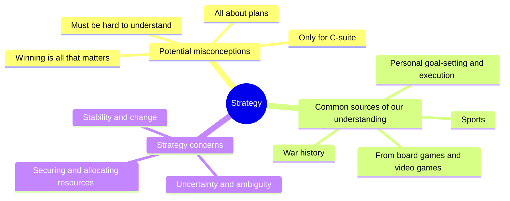

## What is Strategy About?



Our everyday experiences shape our understanding of strategy. We draw insights from strategy games, sports, personal goal-setting, and even military history. However, these sources can also lead to misconceptions:

* **"Strategy is only for the top brass":**  We often associate strategy with generals and CEOs, overlooking its importance at all levels of an organization.
* **"Strategy is just a plan":** While planning is crucial, strategy also involves execution, adaptation, and learning.
* **"Strategy must be secretive and complex":** Effective strategies are often clear, communicable, and adaptable.
* **"Strategy is about beating the competition":**  While competition exists, strategy can also be about collaboration and creating value for multiple stakeholders.

Strategic management in organizations often involves navigating uncertainty and ambiguity, especially when making long-term decisions with broad implications. It's about balancing stability and change: creating an environment where employees can thrive while also helping the organization adapt to a dynamic world. This requires securing and allocating resources effectively to address priorities.

## Why Should ***You*** Care About Strategy?

As you're preparing to launch your career, you might be wondering why a course on strategic management is relevant, especially if you're focused on a specific business function like marketing or finance.  Here's why understanding strategy is crucial for your success:

* **Thriving in Cross-Functional Teams:**  Today's workplace relies heavily on collaboration.  Understanding strategy helps you see the bigger picture and how your specialized skills connect with other areas of the business. This makes you a more valuable team player and leader.

* **Decoding the Job Market:**  When you're interviewing for jobs, being able to analyze a company's strategy and understand how the role you're applying for fits into their overall plan demonstrates a deeper level of engagement and insight. This can give you a significant edge over other candidates.

* **Contextualizing Your Work:**  Even in a specialized role, understanding your company's strategic goals allows you to see how your work contributes to the bigger picture. This adds meaning and purpose to your daily tasks and helps you demonstrate your value to the organization.

* **Communicating Effectively:**  Imagine running into your boss's boss at the water cooler.  Having a grasp of the company's strategic direction allows you to engage in meaningful conversations and show that you're not just focused on your own narrow area.

* **Navigating Your Career:**  Strategic thinking is essential for career advancement.  By understanding how organizations make decisions and adapt to change, you'll be better equipped to navigate your own career path and make choices that align with your long-term goals.

In short, strategic management is not just for CEOs. It's a valuable skillset for anyone who wants to thrive in today's dynamic business world. This course will equip you with the tools and frameworks you need to think strategically, make informed decisions, and contribute to your organization's success from day one.


**2. Course Roadmap & Expectations:**

* **Key topics:**  Give us a clear overview of what we'll learn.  Highlight the most interesting and relevant parts.
* **Assignments:**  Break down the major assignments. What are the expectations? How can we excel? (Sharing that awesome rubric you created would be great!)
* **Grading:**  Be upfront about how we'll be assessed.  What are the "must-dos" to succeed in this course?

**3.  Interactive Stuff:**

* **Icebreaker:**  Something quick and fun to get to know you and our classmates.  Maybe a poll about our career interests or a strategic challenge related to a trending company.
* **Discussion:**  A short discussion about a recent business news story that ties into strategy.  This would get us thinking strategically from day one.

**4.  Tools & Resources:**

* **NotebookLM:**  Since we'll be using it all semester, a quick demo would be super helpful.  Show us some cool features and how it can help us with our projects.
* **Other resources:**  Are there any websites, books, or articles you recommend beyond the assigned readings?


Basically, we want to leave the first session feeling excited about the course, clear on what's expected, and confident that we'll gain valuable skills.

```markdown
[](http://www.youtube.com/watch?v=YOUTUBE_VIDEO_ID_HERE)
```

[](http://www.youtube.com/watch?v=eywi0h_Y5_U)

[](http://www.youtube.com/watch?v=AUCFSWSFStk)

[](http://www.youtube.com/watch?v=MyiI8FoJk54)

