Okay, I'll put on my student hat! Here's what I'd be hoping to hear about in the first session of a Strategic Management course, keeping in mind that we're mostly seniors (and some juniors) in business school:

**1. Big-Picture Context:**

* **What REALLY is strategic management?**  Go beyond the textbook definition. How does it actually play out in companies?  Give us some cool examples of successful (and failed) strategies.
* **Why should we care?**  Connect this to our career goals. How will this course make us better interns, job candidates, or future managers?
* **Debunk the myths:** Is strategy only for top executives?  Is it all about long, boring plans that never get used?

```mermaid
mindmap
  root((Strategy))
    Misconceptions
      Only for C-suite 👔
      All about plans ♟️
      Must be hard to understand ㊙️
      ㊙️
        British popular psychology author Tony Buzan
    Research
      On effectivness<br/>and features
      On Automatic creation
        Uses
            Creative techniques
            Strategic planning
            Argument mapping
    Tools
      Pen and paper
      Mermaid
```




Okay, time to tap into my inner business student again! Here are some common perceptions and ideas that pop into my head when I hear the word "strategy":

**General Perceptions:**

* **Long-term planning:** Strategy is about setting long-term goals and figuring out how to achieve them. It's about looking ahead and making plans for the future.
* **Big-picture thinking:** It involves looking at the whole picture, considering all the factors that might affect a business, and making decisions that benefit the entire organization.
* **Competitive advantage:** Strategy is about finding ways to be better than the competition, whether it's through lower costs, unique products, or stronger customer relationships.
* **Resource allocation:**  It's about deciding how to use a company's limited resources (money, people, time) in the most effective way to achieve its goals.
* **Adaptation and change:**  Strategy is not static; it's about adapting to changes in the environment and making adjustments as needed.

**Potential Misconceptions:**

* **Only for top executives:**  Many people think strategy is only for the CEO and top leaders, but it actually involves people at all levels of an organization.
* **Just about planning:**  While planning is a part of strategy, it's also about execution, monitoring, and making adjustments along the way.
* **Complex and inaccessible:**  Some people find strategy intimidating or confusing, but it can be broken down into manageable frameworks and concepts.
* **Always about winning:**  While strategy often involves competition, it can also be about collaboration, finding win-win solutions, and creating value for multiple stakeholders.

**Personal Experiences:**

* **Playing strategy games:**  Many of us have played strategy games (video games, board games) where we have to think ahead, make decisions with limited resources, and outsmart opponents.
* **Sports and competition:**  We've seen how coaches and teams use strategies to gain an advantage and achieve victory.
* **Personal goals:**  We might even apply strategic thinking to our own lives, setting goals and making plans to achieve them.

By addressing these common perceptions (and misconceptions) in your first session, you can help students develop a more accurate and nuanced understanding of strategic management.


**2. Course Roadmap & Expectations:**

* **Key topics:**  Give us a clear overview of what we'll learn.  Highlight the most interesting and relevant parts.
* **Assignments:**  Break down the major assignments. What are the expectations? How can we excel? (Sharing that awesome rubric you created would be great!)
* **Grading:**  Be upfront about how we'll be assessed.  What are the "must-dos" to succeed in this course?

**3.  Interactive Stuff:**

* **Icebreaker:**  Something quick and fun to get to know you and our classmates.  Maybe a poll about our career interests or a strategic challenge related to a trending company.
* **Discussion:**  A short discussion about a recent business news story that ties into strategy.  This would get us thinking strategically from day one.

**4.  Tools & Resources:**

* **NotebookLM:**  Since we'll be using it all semester, a quick demo would be super helpful.  Show us some cool features and how it can help us with our projects.
* **Other resources:**  Are there any websites, books, or articles you recommend beyond the assigned readings?


Basically, we want to leave the first session feeling excited about the course, clear on what's expected, and confident that we'll gain valuable skills.

```markdown
[](http://www.youtube.com/watch?v=YOUTUBE_VIDEO_ID_HERE)
```

[](http://www.youtube.com/watch?v=eywi0h_Y5_U)

[](http://www.youtube.com/watch?v=AUCFSWSFStk)

[](http://www.youtube.com/watch?v=MyiI8FoJk54)

