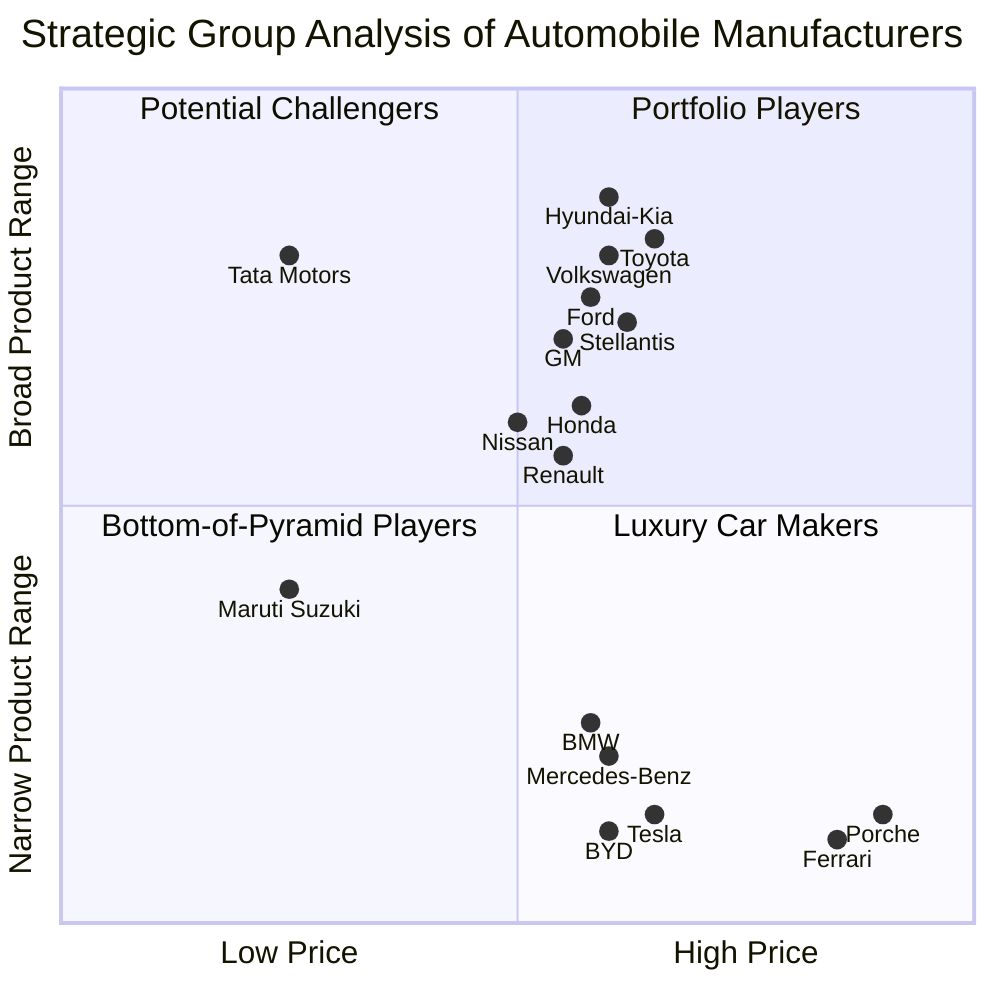

```mermaid
quadrantChart
    title Strategic Group Analysis of Automobile Manufacturers
    x-axis Low Price --> High Price
    y-axis Narrow Product Range --> Broad Product Range
    quadrant-1 Portfolio Players
    quadrant-2 Potential Challengers
    quadrant-3 Bottom-of-Pyramid Players
    quadrant-4 Luxury Car Makers
    Tesla: [0.65, 0.13]
    BYD: [0.6, 0.11]
    BMW: [0.58, 0.24]
    Mercedes-Benz: [0.6, 0.2]
    Ferrari: [0.85, 0.10]
    Porche: [0.90, 0.13]
    Ford:  [0.58, 0.75]
    GM: [0.55, 0.70]
    Volkswagen: [0.6, 0.8]
    Stellantis: [0.62, 0.72]
    Toyota: [0.65, 0.82]
    Hyundai-Kia: [0.6, 0.87]
    Honda: [0.57, 0.62]
    Nissan: [0.50, 0.6]
    Renault: [0.55, 0.56]
    Tata Motors: [0.25, 0.8]
    Maruti Suzuki: [0.25, 0.4]
```